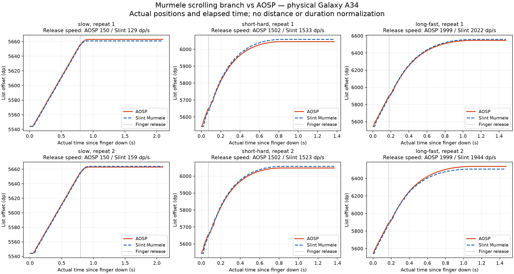

<!-- Copyright © SixtyFPS GmbH <info@slint.dev> -->
<!-- SPDX-License-Identifier: MIT -->

# Galaxy A34 Recordings

These six screen swipes were recorded on September 30, 2026, on a Samsung Galaxy A34 running Android 16.
The Release build uses Murmele's `mm/flickable-scroll-animation-v2` at `bdbec1e437`, with the comparison harness at `406a18d41a`.
See [FINDINGS.md](../../FINDINGS.md) for results and measurement limits.

Each case contains the complete compressed CSV and the two log lines used to identify native and Slint release estimates.
The full device logs, screenshots, and APK remain local; the retained log excerpts contain only comparison diagnostics.
`results.json` preserves all original pass/fail outcomes, including the failing slow release estimate.
`diagnosis.json` contains the offline estimator and spline replay.
`build.json` records source, configuration, and the deployed APK hash.

Run the replay from the comparison app directory:

```sh
uv run --with numpy scripts/replay_diagnosis.py \
  evidence/murmele-galaxy-a34-2026-09-30 --verify --output /tmp/scroll-diagnosis.json
```

The replay reads compressed CSVs directly.
Its numerical bounds apply to these six straight, unbounded flings and the recorded source revision.
It does not prove native/Slint parity or validate different future physics implementations.

The charts use absolute list offsets and actual time since finger down.
Neither distance nor duration is normalized, and neither line is shifted to overlap the other.


