<!-- Copyright © SixtyFPS GmbH <info@slint.dev> -->
<!-- SPDX-License-Identifier: MIT -->

# UIKit and Slint: Three-Part Physics Report

October 1, 2026. Physical iPhone 13 Pro Max, iOS 27.0, Release, Cupertino style, Winit/Skia.
Source baseline: Murmele/slint `mm/flickable-scroll-animation-v2`, commit `5e0f6d10f14857cc4adc8aedda56b91ec65cb24f`.
Both views measure 408 × 774 points and have 400 × 72000-point content with 72-point rows.
The new automated position captures have a median interval near 8.335 ms, approximately 120 Hz.
This measures position sampling, not a claim that both renderers draw every sample.
A point is three physical pixels on this phone.
Raw touch callbacks and returned coalesced samples are recorded before forwarding the original events to Slint.
UIKit content changes, pan actions, and Slint drag updates also have direct callback timestamps.
Every chart uses actual point distances and elapsed time, without normalization.

**Status:** the pull mapping matches closely on the tested paths.
The spring candidate improves the return but still fails the matching criterion.
Immediate pan entry remains unmatched.
These are opt-in diagnostic code changes, not a production parity fix.

## Part 1: Before Changes

Slint subtracts an 8-point threshold, then applies overscroll friction to each event delta according to the current displayed exposure.
A first movement crossing the boundary can pass through unresisted.
Different batching of the same total movement can therefore produce different exposure.

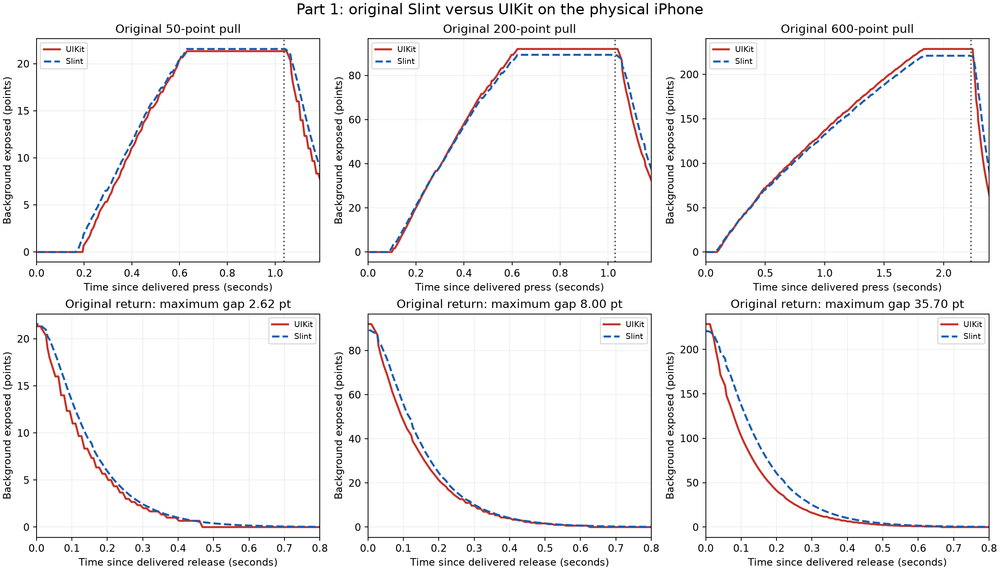

UIKit consumed 10 points on explicitly held paths; Slint consumed 8.
Immediate UIKit paths consumed 10–15.333 points in earlier captures.
This measures discarded list movement, not a universal recognizer threshold.

Recognition was observed before the pan action reset the translation baseline.
Apple documents that the `began` action runs in the next run-loop cycle.
[Apple: UIGestureRecognizer.State.began](https://developer.apple.com/documentation/uikit/uigesturerecognizer/state-swift.enum/began).
Disabling Slint touch forwarding did not eliminate UIKit's additional discarded movement.

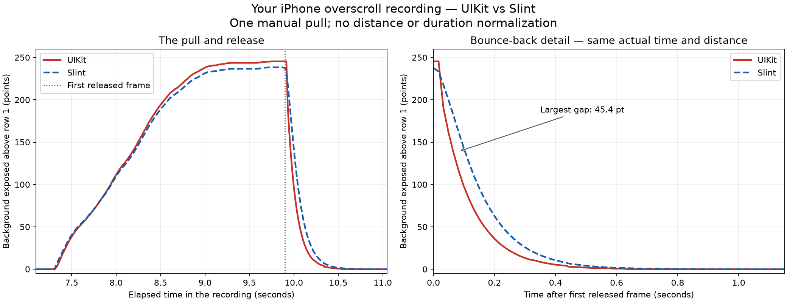

That earlier real-finger capture ran at 60 Hz.
Its peak return gap was 45.418 points, with settling within 0.5 points after about 0.642 seconds for UIKit and 0.742 seconds for Slint.
It is separate from the later 120 Hz automated captures.

## Part 2: Fixing the Pull

The candidate uses a 10-point threshold and an absolute rubber-band mapping:

```text
exposure = 0.55 × distance × viewport / (viewport + 0.55 × distance)
```

The coefficient was proposed from the 200-point capture.
The 50- and 600-point paths were checks outside that calibration distance.
Each event inverts the current exposure, adds the finger delta in the underlying drag coordinate, and reapplies the mapping.
A unit test verifies batching independence and reversals at both bounds.

| Pull | UIKit peak | Modified Slint peak | Absolute gap |
| ---: | ---: | ---: | ---: |
| 50 pt | 21.333 pt | 21.392 pt | 0.059 pt |
| 200 pt | 92.000 pt | 92.069 pt | 0.069 pt |
| 600 pt | 228.667 pt | 228.642 pt | 0.025 pt |

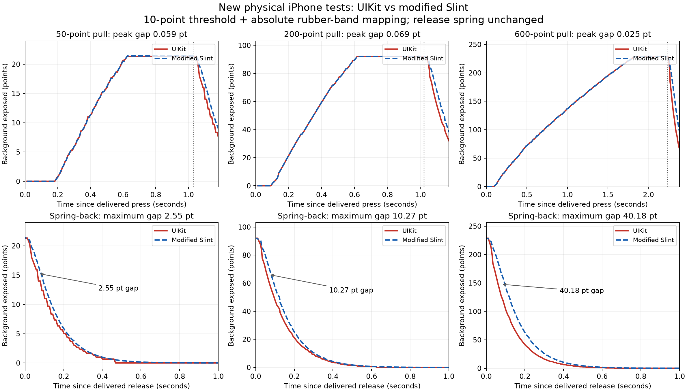

The 10-point threshold removed the held 40-point path's 2-point gap in both repeats, including zero sampled contact separation.
Immediate paths still diverged.
Each panel below compares its own paired UIKit and Slint capture; requested waypoint counts do not describe delivered event counts.

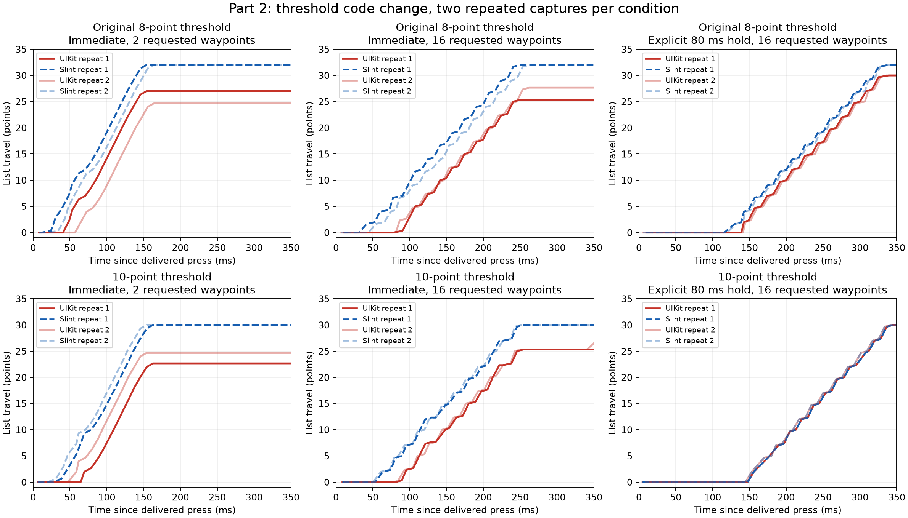

No mode reads UIKit positions to drive Slint.

## Part 3: The Return Animation

The original spring operates on displayed exposure, with mass 0.5, stiffness 100, damping ratio 1.1, and zero initial velocity.
The candidate evolves spring travel in the underlying drag coordinate and maps that travel back to the display.
An empirical initial-return rate of 2.4422646 per second was calibrated from the 200-point trace.
This is a candidate black-box model, not a claim about UIKit private code.

| Pull | Original spring maximum gap | Candidate maximum gap |
| ---: | ---: | ---: |
| 50 pt | 2.549 pt | 1.167 pt |
| 200 pt | 10.269 pt | 2.458 pt |
| 600 pt | 40.177 pt | 7.760 pt |

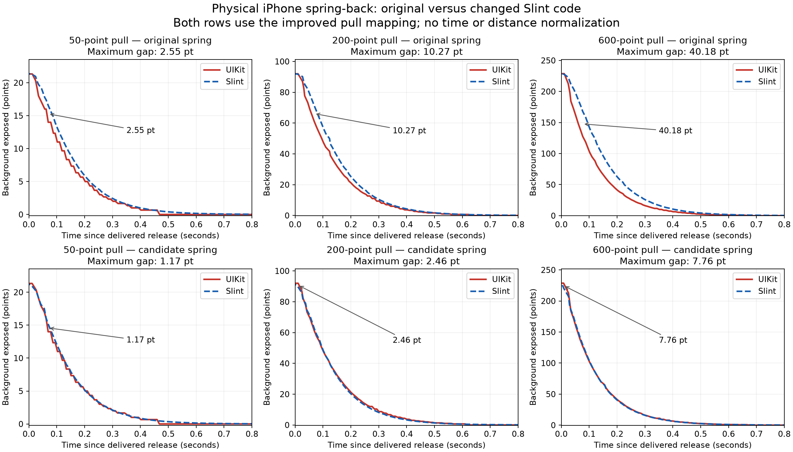

Three unseen distances were each repeated twice:

| Pull | Repeat 1 maximum gap | Repeat 2 maximum gap |
| ---: | ---: | ---: |
| 100 pt | 1.894 pt | 1.201 pt |
| 300 pt | 4.016 pt | 3.764 pt |
| 450 pt | 7.197 pt | 6.969 pt |

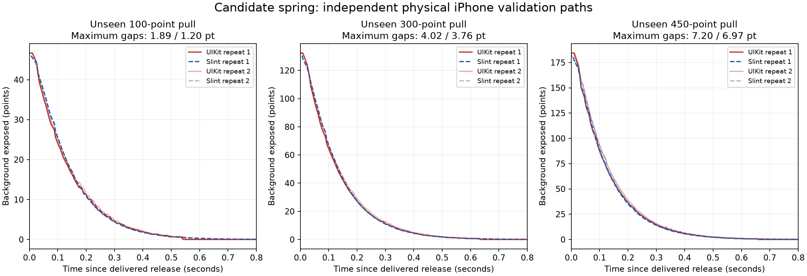

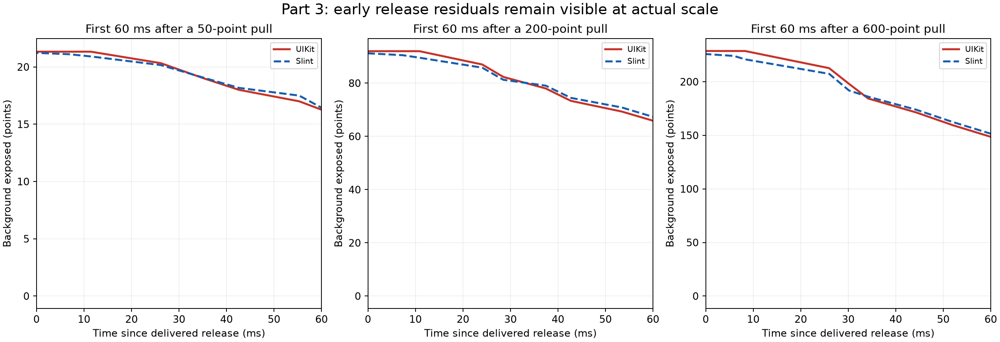

The predeclared criterion was at most 0.5 points throughout return in every complete trace.
The candidate fails it.
It is an improvement, not a solved spring.

### One More Round: Testing the Release Clock

The final round compared the spring candidate against the same model started from live backend time.
The coefficients and position mapping were unchanged.
Each variant ran 200- and 600-point pulls twice.

| Pull | Animation-tick start RMS, repeats 1 / 2 | Live-clock start RMS, repeats 1 / 2 |
| ---: | ---: | ---: |
| 200 pt | 0.712 / 0.771 pt | 1.014 / 0.784 pt |
| 600 pt | 1.481 / 1.682 pt | 1.864 / 1.818 pt |

RMS uses the same actual 0–0.8-second interval after delivered release in every capture.
The live-clock version was worse in both repeats at both distances.
It is retained as a reproducible control, not an accepted fix.

The recorder saw 400–409 ms of clock age before forwarding release after a stationary hold.
After event processing, the recorded clock age at UIKit's ended action was only 1.375–2.724 ms.
Those observations occur at different points in dispatch and must not be mistaken for clock age at spring construction.
They do not support a 400 ms stale-clock explanation for the spring mismatch.

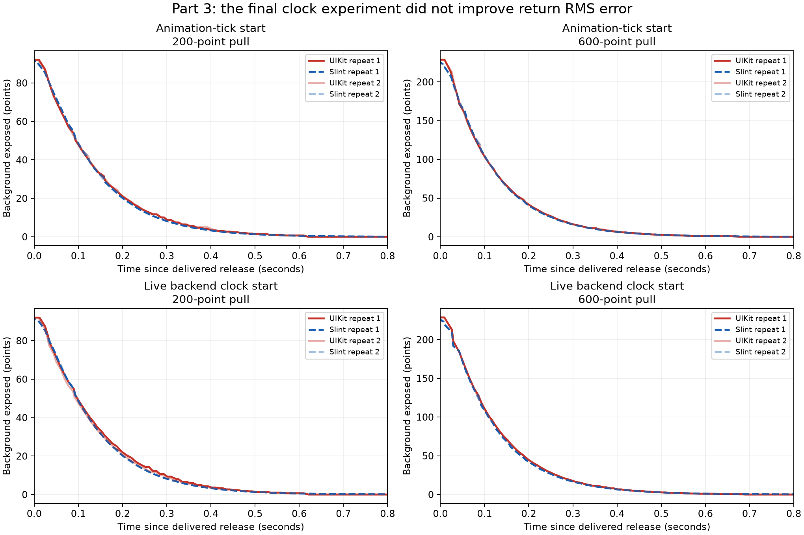

[Final clock-round aggregates](report/evidence/clock-round-summary.json) retain all eight captures.
Native ended-action callbacks arrived approximately 2.67–5.82 ms after the forwarding callback.
The remaining early-frame gap needs a separate animation-handoff and display-phase test.
A numeric spring fit alone has not explained it.

### Validation and Evidence

The first experiment round contains 18 complete pan traces and 18 complete pull traces.
The final clock round adds eight complete traces, for 44 automated captures.
The older manual recording is separate from that count.
Delivered distances and stationary holds were checked from the actual events.
The spring unit tests and rubber-band batching/reversal test passed.
Green XCTest results establish gesture delivery and settling, not physics parity.
A first inconsistent threshold implementation failed its motion assertion and was corrected before these comparisons.

- [Pan aggregate results](report/evidence/pan-summary.csv).
- [Pull aggregate results](report/evidence/pull-summary.csv).
- [Written predictions](report/evidence/PREDICTIONS.md).
- [Capture validation](report/evidence/validation.json), including the failed spring criterion.
- [Build and selected-test instructions](README.md).

The published evidence contains charts and per-gesture aggregates.
Raw per-event touch CSVs and `.xcresult` bundles remain local.
For a full match, pan dispatch, release velocity, spring timing, boundary transitions, and carried momentum still need independent validation.
UIKit provides recognized pan state, translation, and velocity through [UIPanGestureRecognizer](https://developer.apple.com/documentation/uikit/uipangesturerecognizer).
Passing equivalent semantics through the backend is a candidate for the unresolved pan-entry problem; it is not verified by this campaign.
The Winit adapter on this branch supplies `event_time: None` and empty history for touch events.
The recorder's UIKit timestamps and coalesced samples are therefore absent from the ordinary Slint physics input.
The simulator `spring-history` diagnostic supplies those press/move samples through the core's internal touch event.
It also changes dispatch route and refreshes timers, so it cannot isolate history's effect without another control.
Core touch conversion still discards the release timestamp when creating the pointer release.
The core release estimator and carried-momentum model were not changed here.
The forwarding control excludes direct Slint touch forwarding as a necessary cause of extra pan loss, but does not exclude all recording or scheduling effects.
This campaign does not establish parity for interruptions, multitouch, or carried momentum.
The follow-up below measures free-flight boundary collisions separately from held pulls.

### Simulator Alternatives and Failed Delivery Controls

The iPhone 18 Pro Simulator uses its own UIKit reference and a 382 × 722-point viewport.
Its measured sampling interval is about 16.67 ms, approximately 60 Hz.
Four modes ran 200- and 600-point pulls twice: the current candidate, deferred release, zero initial spring velocity, and direct touch timestamps/history.
Only 11 of 16 traces qualify for physics comparison after checking delivered distance, sample gaps, and settling.
None meets the 0.5-point full-return criterion.

The deferred-release control lost Slint release delivery in all four traces.
Its flat Slint curves are a harness failure, not evidence against a spring equation.
Zero initial spring velocity improved the large-distance simulator cases but did not consistently improve the 200-point cases.
Direct timestamps/history also did not consistently improve the result and change the dispatch route and timer refresh, so these tests cannot isolate history's effect.
Failed controls remain in the aggregates and plots.

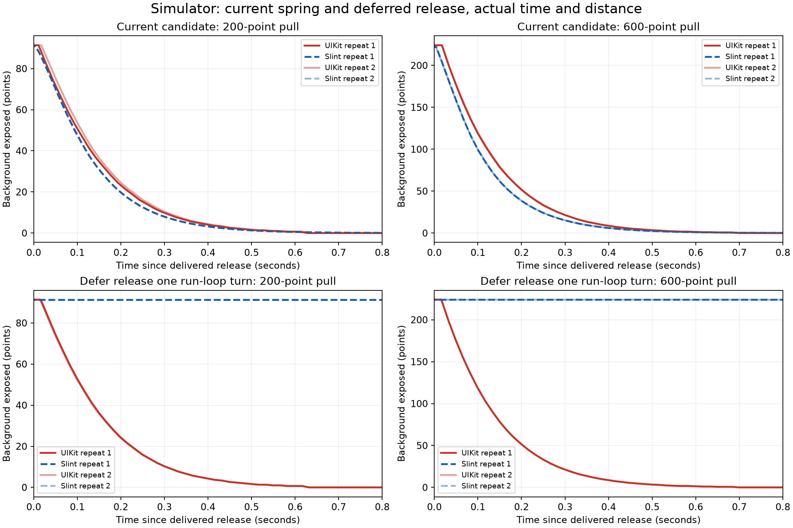

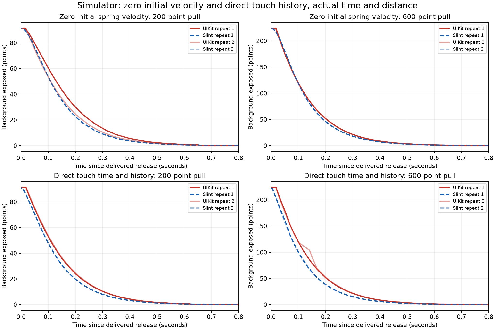

### Release Momentum: Immediate, Held, and Quiet-Stop Paths

A new matrix uses 100- and 600-point pulls, velocity settings 400 and 1600, immediate or 400 ms held release, and two repeats on each platform.
The public XCTest press/drag/hold API delivers these paths.
Settings label the automation request; the evidence retains delivered speeds in points per second separately.
The first dense private-injector matrix compressed requested timing and is retained locally as unsuitable delivery evidence.
It is excluded from the conclusions below.

The fixed public matrix has 16 of 16 qualified phone traces and 14 of 16 qualified simulator traces.
A quiet-stop control adds one physical pixel of slow motion at the end of the hold to refresh the recognizer's velocity estimate.
Its four phone traces and three of four simulator traces qualify.
Together, 37 of 40 traces satisfy gesture delivery and the predeclared maximum 30 ms post-release sampling gap.
The three sampling failures remain visible and are excluded from numerical conclusions.
No sample-gap limit was relaxed to pass them.

On the phone, the fast 100-point immediate releases gain another 28 points of native exposure after lift.
The exact 400 ms held releases gain 33.33–39.67 points.
Slint adds no outward exposure in these cases.
The native recognizer still reports cached velocities around 1216–1444 points/s after an exactly motionless hold, although the delivered touch positions do not move.
That cached value is not direct access to UIKit's private animation initial velocity.
The quiet-stop control refreshes the recognizer estimate to approximately −1.336 points/s and produces no further outward exposure.
A stationary synthetic hold therefore does not establish a zero-velocity native release.

The slower 100-point paths and the tested 600-point paths have no extra native exposure after release.
Their return curves still differ from Slint.
Some fast small pulls already have different UIKit and Slint exposure at release because pan entry remains unresolved.
Return RMS includes that starting-position difference; it must not all be attributed to spring coefficients.
The quiet-stop paths also have different delivered motion histories, so their two distances do not provide a matched-speed coefficient test.

Source inspection shows two concrete limits in the Slint path:

- An outside-bounds release calls `spring_back` using current position without passing estimated release velocity.
- The velocity tracker treats the pointer as stopped when its last move is more than 40 ms old.

The candidate's initial spring kick is derived from displacement, not from actual release velocity.
It cannot account for all measured release states with one displacement-only return curve.
The measurements do **not** prove that UIKit varies stiffness or damping with distance or speed.
Different initial velocities, nonlinear resistance, and the absolute settling tolerance can change visible curves and settling times with fixed coefficients.
A model that uses the correct release state must be tested before inferring changing coefficients.

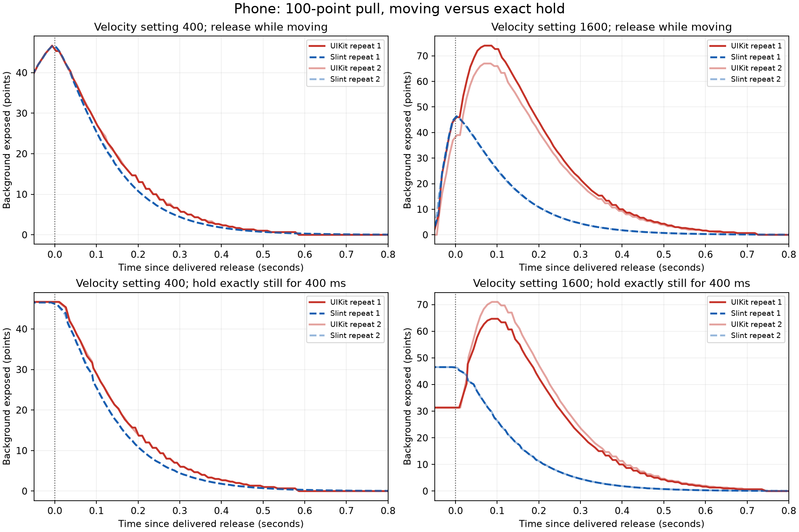

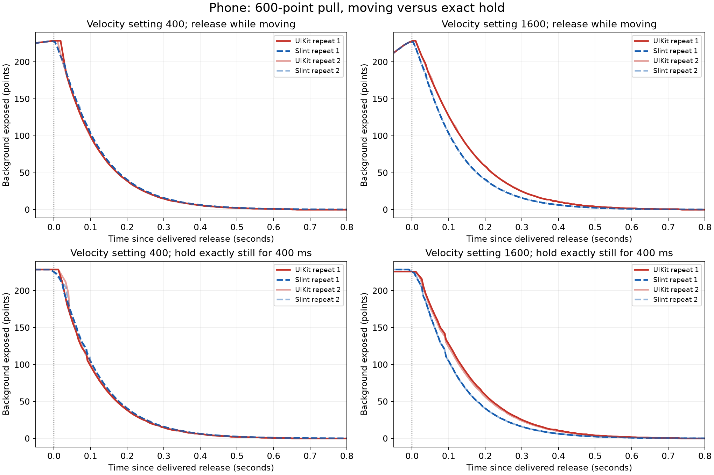

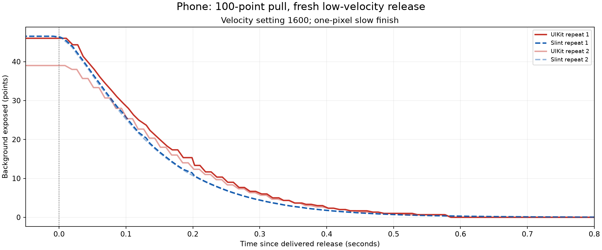

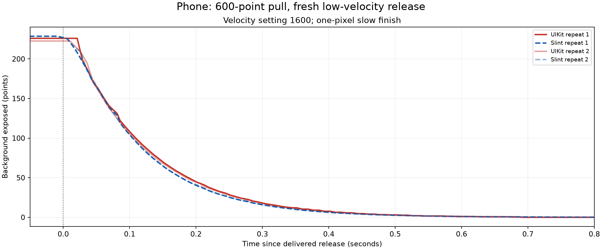

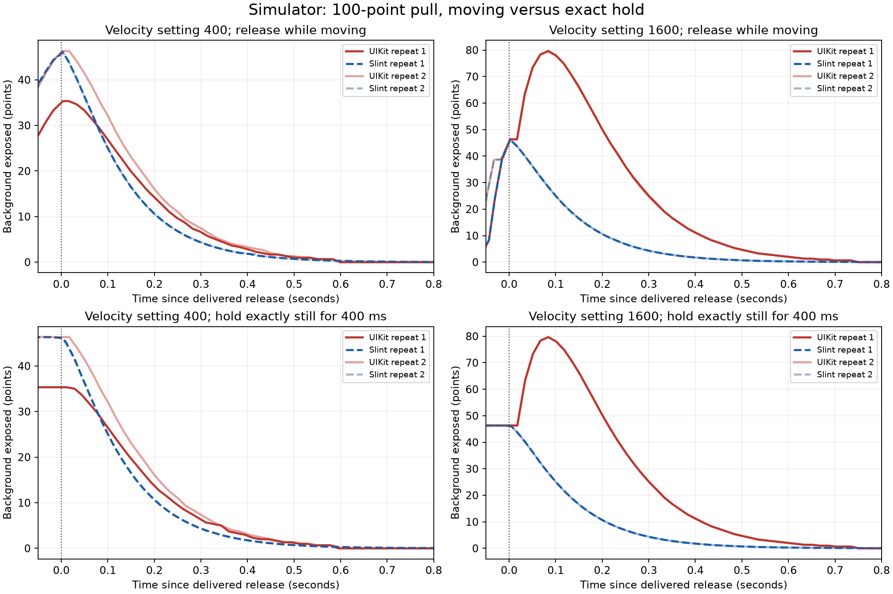

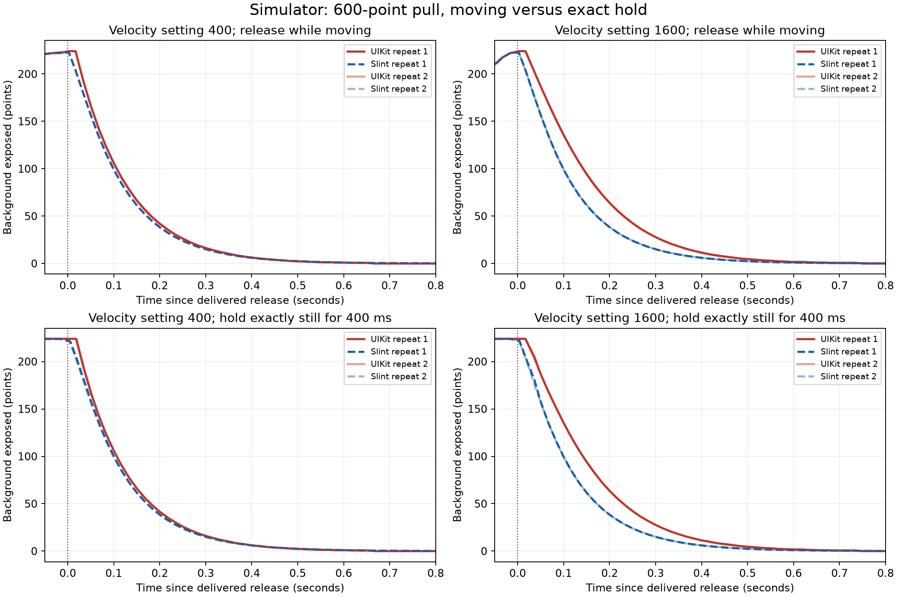

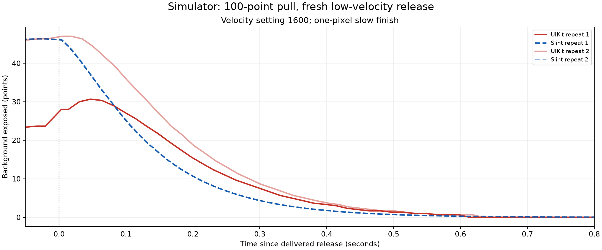

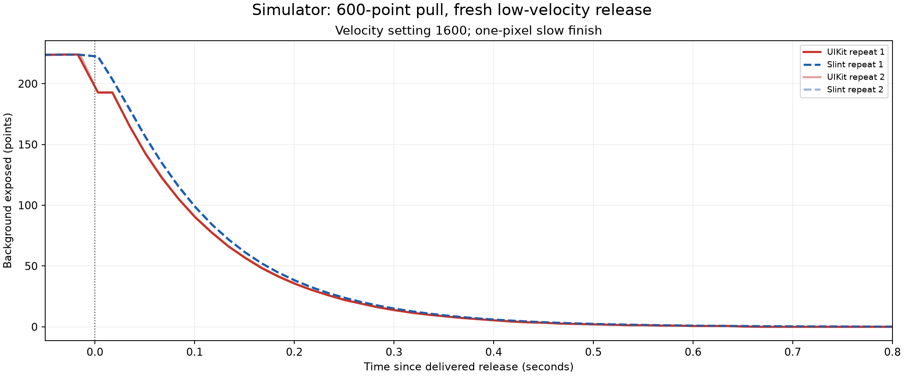

### Natural Collision After Release

The corrected campaign starts both lists at item 10, offset 648 points, in a full 1000-row list.
A downward 200-point finger path heads toward the start and lifts immediately after motion.
Both lists must remain inside their bounds throughout contact and at release.
Six velocity settings (400, 1000, 1500, 2200, 3000, 4500) each run twice in fresh launches.
A setting that stops inside is a no-hit observation, not an invalid gesture.
The first bottom-boundary campaign used the opposite direction and a shorter list; it is separate and does not answer this top-boundary question.

These tests measure the natural free-flight collision, not a pull that releases already outside the bounds.
Slint uses its existing `IOsFlick` collision path here, which transfers impact velocity into a spring.
The experimental outside-release spring is a separate code path.
The existing collision model has mass 0.5, stiffness 100, and damping ratio 1.1.
It has a 5000 points/s transfer-velocity clamp whose sign handling also needs separate coverage; these captures alone do not establish its high-speed limit.

The analyzer derives impact from recorded offsets, fits speed over the 50 ms before impact when at least three samples are available, and records exposure peak, time to peak, return, and settling within 0.5 points.
Missing speed estimates are explicit rather than invented from the requested velocity setting.
Crossings with at most 0.5 points of exposure are flagged as unresolved bounce amplitudes, without deleting their raw crossing times.
Position differences are also evaluated on a 20 Hz grid interpolated from the captured samples.
All charts use actual seconds from one delivered release callback and actual points.
Impact markers are separate for each list; neither curve is shifted to align collisions.

**Physical phone:** 12/12 traces qualify for gesture and sampling comparison.


| Velocity setting | UIKit peak range | Slint peak range | UIKit impact-to-settle | Slint impact-to-settle |
| ---: | ---: | ---: | ---: | ---: |

| 400 | No hit | No hit | No hit | No hit |

| 1000 | No hit | No hit | No hit | No hit |

| 1500 | 10.333–11.333 pt | 8.281–8.877 pt | 0.551–0.554 s | 0.439–0.446 s |

| 2200 | 33.667–34.333 pt | 27.706–28.454 pt | 0.662–0.681 s | 0.570–0.575 s |

| 3000 | 67.000–68.333 pt | 50.640–54.631 pt | 0.744–0.750 s | 0.641–0.651 s |

| 4500 | 111.000–112.667 pt | 90.905–111.065 pt | 0.798–0.800 s | 0.706–0.726 s |


**Simulator:** 11/12 traces qualify for gesture and sampling comparison.


| Velocity setting | UIKit peak range | Slint peak range | UIKit impact-to-settle | Slint impact-to-settle |
| ---: | ---: | ---: | ---: | ---: |

| 400 | No hit | No hit | No hit | No hit |

| 1000 | No hit | 0.093–0.093 pt | No hit | Unresolved |

| 1500 | 20.333–20.667 pt | 14.808–14.868 pt | 0.607–0.613 s | 0.506–0.508 s |

| 2200 | 43.000–43.333 pt | 31.395–31.794 pt | 0.697–0.700 s | 0.596–0.600 s |

| 3000 | 23.333–80.000 pt | 23.741–121.811 pt | 0.629–0.769 s | 0.567–0.748 s |

| 4500 | 47.333–47.333 pt | 34.089–34.884 pt | 0.701–0.701 s | 0.597–0.601 s |


All phone collisions at settings 1500 and above occur after release on both sides.
Slint peaks earlier and settles 74–112 ms earlier than UIKit in those eight phone collisions.
Slint's fitted pre-impact speeds are higher, yet seven of the eight exposure peaks are smaller.
One 4500-setting repeat has nearly equal exposure peaks while its timing still differs.
This distinguishes matching a peak from matching the full animation.

The simulator's first 400-setting trace has a 33.11 ms sample gap and is excluded from numerical conclusions.
The first 1000-setting trace records a 0.093-point Slint crossing without a native crossing; its exposure is below the 0.5-point resolution criterion and is retained as unresolved.
The simulator's two 3000-setting repeats have markedly different delivered behavior.
Their requested settings must not be treated as identical measured momentum.
Within each capture, UIKit and Slint receive the same forwarded touch objects; different timestamp/history handling remains part of the Slint path under test.
The higher settings produce clear post-release collisions on both platforms, but neither the incoming speed nor the bounce timing is a full match.

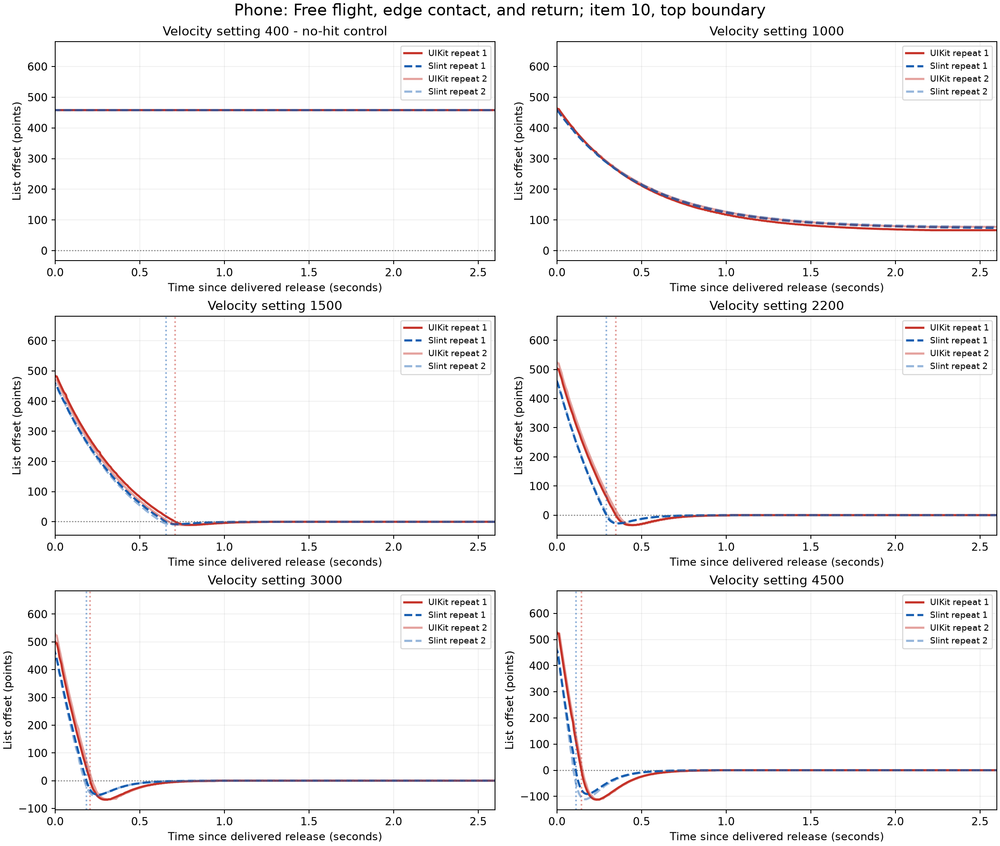

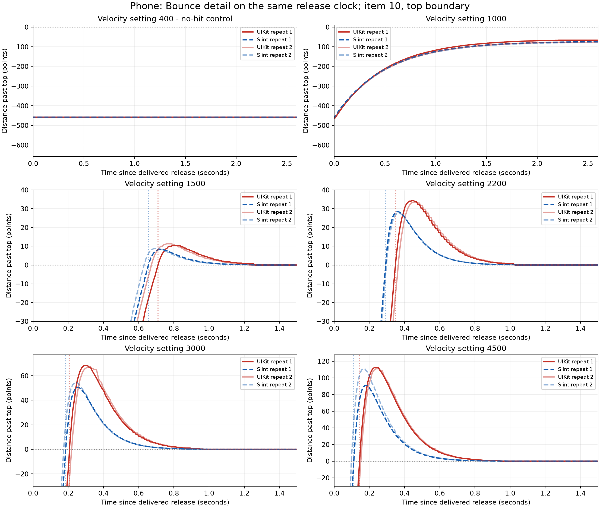

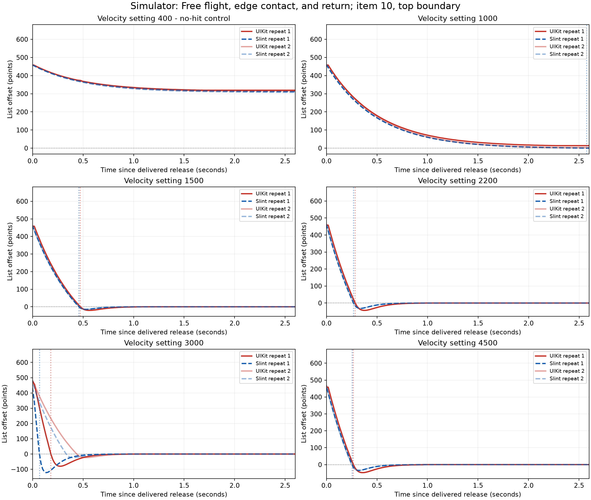

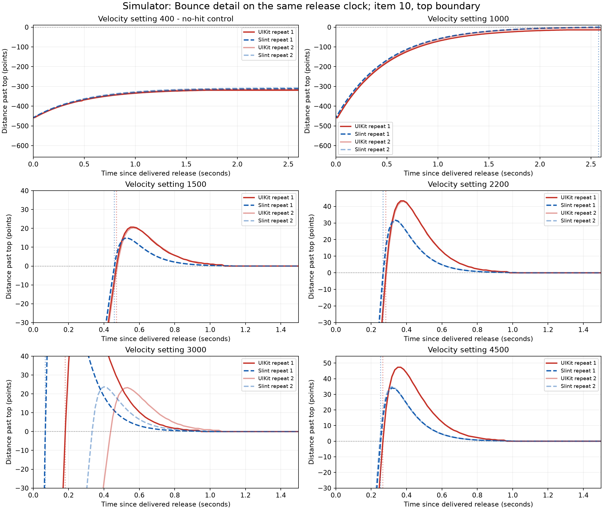

### Reproduce the Figures

Install NumPy and Matplotlib in a local environment, obtain the private capture directories, and run:

```sh
python report/scripts/plot_report.py --round1 /path/to/round1/raw --round2 /path/to/round2/raw --output report/figures
```

Raw touch publication requires separate approval, so those input directories are not in this PR.
The source app and selected test commands produce new CSVs that can be used with the same plot script.
That script regenerates baseline, pan, early-release, and clock figures; earlier candidate/manual figures are retained separately.
The [report PDF](report/REPORT.pdf) contains the same three parts and every chart above.
