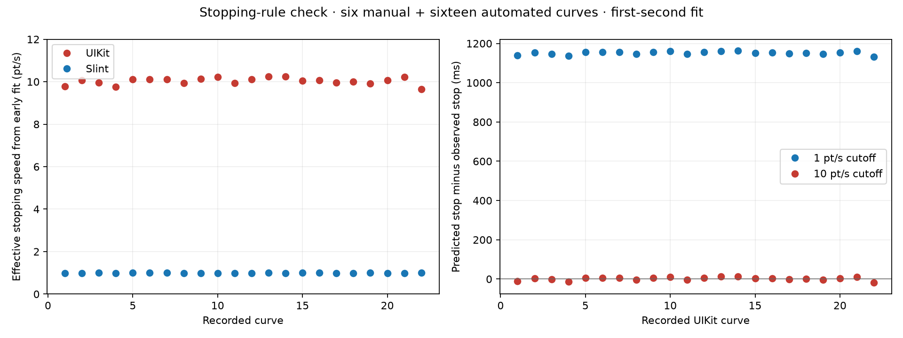

<!-- cspell:ignore UITouch coalescedTouches event_time current_tick -->
# Scroll Mismatch Diagnosis

The data and current source identify separate stopping and input problems.
This diagnosis uses six uninterrupted manual flings and 16 automated paired captures.
It makes no engine changes.

## The In-Bounds Animation Stops Too Late

Slint retains 0.135 of velocity per second and ends the friction simulation below one point per second.
See [the source constants](https://github.com/Murmele/slint/blob/acc4afb5fd8e6f3c0e7f2a587c2649d0e23e3a03/internal/core/animations/simulations/ios.rs#L33).

We used that fixed decay rate and fitted only position offset and initial amplitude from 0.08–1.0 seconds of each curve.
Later samples and stopping times were not used to fit those parameters.
Across all 22 UIKit curves, the inferred speed at the final observed movement is 9.65–10.25 points per second.
Across the paired Slint curves, it is 0.98–1.01 points per second.

| UIKit Prediction | Mean Absolute Stop-Time Error | Worst Stop-Time Error | Mean Later-Position RMS |
| --- | ---: | ---: | ---: |
| Freeze below 1 pt/s | 1.151 s | 1.162 s | 2.917 pt |
| Freeze below 10 pt/s | 0.0066 s | 0.0176 s | 0.428 pt |

A tenfold cutoff difference adds `ln(10) / -ln(0.135) = 1.1499` seconds to an exponential tail.
That matches the size of the observed extra creep.
Slint's bulk decay matches the recorded shape closely; its visible terminal behavior does not.
Adding a new constant-deceleration term did not improve the late-sample predictions in this check.

The ten-point cutoff is a predictive description of observed positions on this device.
It is not proof of a literal private UIKit constant.
Pixel alignment, animation completion, and refresh cadence may participate in UIKit's stopping rule.
Record `isDecelerating`, its completion callback, and display timing before claiming the exact internal rule or generalizing across devices.

Raising Slint's stopping tolerance would remove about 4.49 points of travel for an unchanged starting velocity.
Its velocity initialization and remaining-distance reporting must therefore be checked alongside any tolerance change.
This offline prediction is not a tested engine fix.

## iOS Touch History and Capture Times Are Lost

The app resolves Winit 0.30.13.
Its [UIKit moved handler](https://github.com/rust-windowing/winit/blob/v0.30.13/src/platform_impl/ios/view.rs#L142) ignores the UIEvent argument and sends only the current touch.
The [Slint adapter](https://github.com/Murmele/slint/blob/acc4afb5fd8e6f3c0e7f2a587c2649d0e23e3a03/internal/backends/winit/winitwindowadapter.rs#L1605) explicitly supplies no event timestamp and an empty history.

The core supports history, but that does not mean this backend supplies it.
It consequently estimates motion using dispatch-time samples rather than UIKit's captured sample times and full history.
Apple documents [touch timestamps](https://developer.apple.com/documentation/uikit/uitouch/timestamp) and [coalesced samples](https://developer.apple.com/documentation/uikit/uievent/coalescedtouches(for:)) for recovering those measurements.

## Sparse Samples Lose Weight

The [iOS tracker](https://github.com/Murmele/slint/blob/acc4afb5fd8e6f3c0e7f2a587c2649d0e23e3a03/internal/core/items/flickable/velocity_tracker/ios.rs#L20) blends three adjacent segment velocities with weights 0.6, 0.35, and 0.05.
Missing segments contribute zero rather than causing the remaining weights to be renormalized.
With only a press and two moves, the oldest segment is missing; the remaining weights total 0.4.

Manual gesture 9 contains only two move callbacks.
Applying this formula to those primary samples yields 152 pt/s using capture times, or 197 pt/s using callback times.
UIKit's pan estimate is about 402 pt/s.
Both reduced estimates fall below Slint's 250 pt/s fling gate and are consistent with the observed absence of Slint coasting.

Gesture 10 gives 243 pt/s using callback times, below the gate, versus UIKit's 280 pt/s.
The same primary positions with captured touch timestamps give 279 pt/s.
This shows why delivery-time jitter near the gate matters.
These calculations reconstruct plausible tracker inputs; they do not directly log Slint's internal estimate.

The tracker weights originate in Flutter's approximation, not published UIKit code.
Flutter's [implementation](https://github.com/flutter/flutter/blob/master/packages/flutter/lib/src/gestures/velocity_tracker.dart) explicitly distinguishes its estimated scrolling velocity from the pan recognizer's velocity.
That source establishes provenance; it is not evidence that the approximation matches UIKit.

## Final Movement on Release Is Ignored

The [touch-state end path](https://github.com/Murmele/slint/blob/acc4afb5fd8e6f3c0e7f2a587c2649d0e23e3a03/internal/core/input.rs#L2471) emits Released and Exit without a final moved sample.
The [Flickable release path](https://github.com/Murmele/slint/blob/acc4afb5fd8e6f3c0e7f2a587c2649d0e23e3a03/internal/core/items/flickable.rs#L1310) starts the simulation without feeding the released position to the tracker.

In gesture 9, the release position is another two points beyond the last move.
In gesture 10, it is another 1.667 points beyond it.
Appending those nonzero final movements to the callback-time calculation raises the estimates from 197 to 520 pt/s and 243 to 271 pt/s.
Both cross the fling gate.
The old estimates are not merely stale from a held finger: the last callback-to-release gaps are only 9.43 and 7.93 ms.

Adding every release blindly would be wrong for held releases.
Only genuine final movement, with its captured time and correct ordering, should affect the estimate.
The exact fix needs a recorded internal-estimator value and a paired native comparison.

## Pan Entry Also Adds a Position Difference

During manual gesture 5, Slint moves while UIKit's recognizer is still possible.
Slint subtracts its fixed ten-point threshold and then applies further movement.
UIKit's observed translation resets as its recognizer enters active scrolling.
The before-release travels are 38 points for Slint and 17.667 points for UIKit, already 20.333 points apart.
This contributes to different endpoints independently of the later velocity and tail problems.
It requires recognition-state-aware validation; a fixed distance threshold alone is not a one-to-one native recognizer model.

## Fix Order and Remaining Proof

1. Preserve captured times and coalesced samples through Winit and the Slint adapter.
2. Feed genuine final release movement before estimating velocity.
3. Log the internal estimate and gate decision; verify sparse-sample weighting against native behavior.
4. Validate the effective ten-point terminal rule using the existing parity test, without hiding velocity or travel differences.
5. Test pan-entry translation separately from inertial travel.

[Velocity reconstruction](evidence/diagnosis/velocity-replay.json) and [stopping-rule checks](evidence/diagnosis/stop-rule-check.json) retain every evaluated case.
The captured-time and callback-time estimates are labelled separately.
Neither the fitted curve nor any graph is normalized in time or distance.
