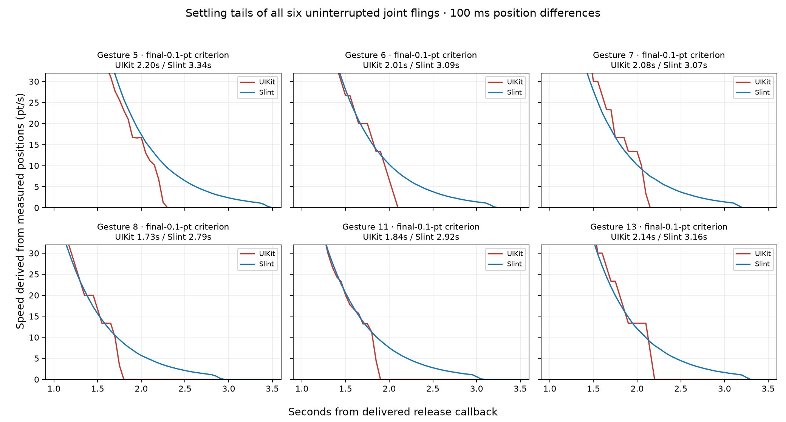
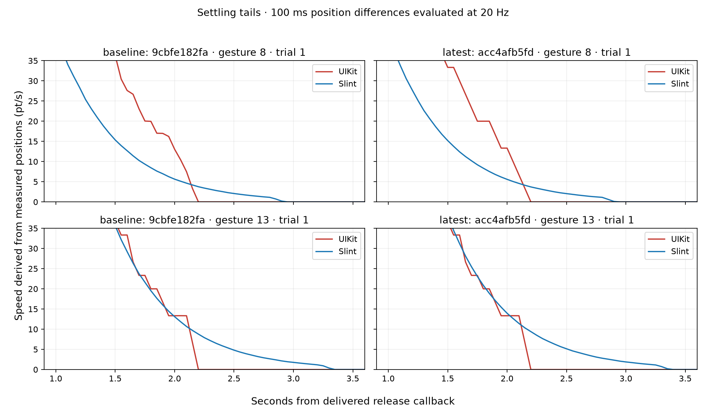
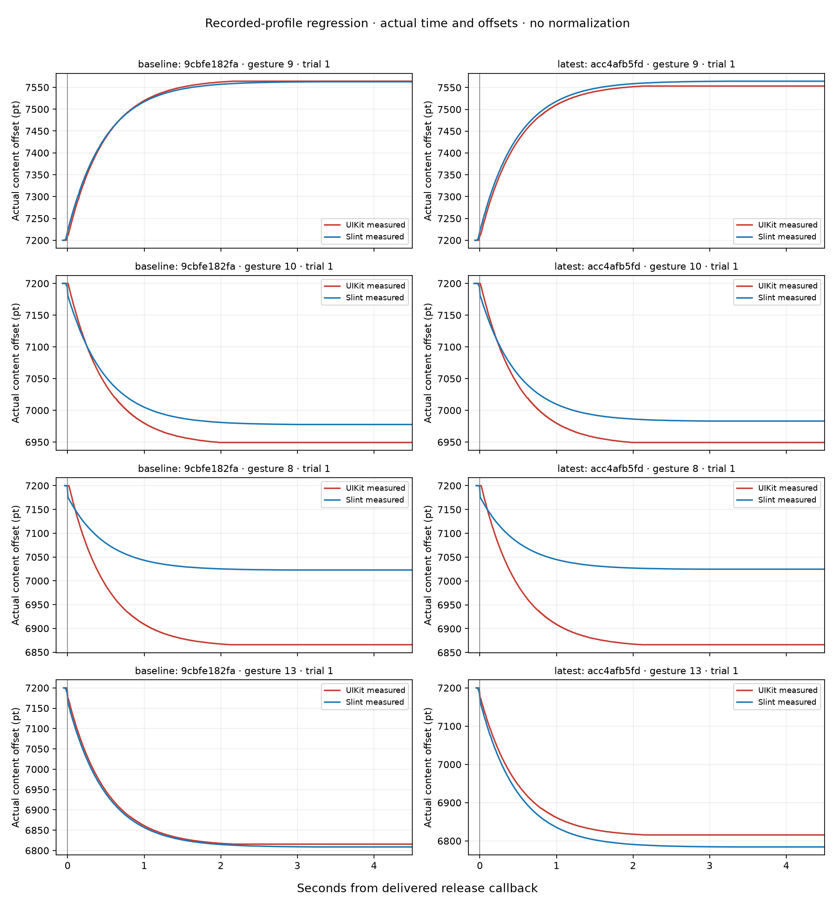

<!-- cspell:ignore XCTest xcresult UIKit -->
# Short Flicks and Settling Tails

The recorded settling-tail discrepancy reproduces as an automated XCTest failure on both engine revisions.
The newly pulled engine still coasts longer than UIKit near rest.
Post-release travel mismatches also remain.

## What Was Tested

- Baseline engine: [`9cbfe182fa`](https://github.com/Murmele/slint/commit/9cbfe182fac88346c8fd2f5617ad44346bf5e263).
- Latest tested engine: [`acc4afb5fd`](https://github.com/Murmele/slint/commit/acc4afb5fd8e6f3c0e7f2a587c2649d0e23e3a03).
- iPhone 13 Pro Max, iOS 27.0 build 24A437, October 5, 2026.
- Release build, Cupertino style, Winit with Skia.
- Four vertical replay profiles, twice each per engine; fresh app at offset 7,200 points.
- All 16 paired cases passed delivery, geometry, sampling, and final-rest checks.
- Both XCTest runs failed the physics assertions. These are intentional regression failures, not build failures.

The app's recording code and test profiles are the same for both runs.
No engine changes are included in this PR.
The baseline was tested before pulling the new engine changes.

## Original Manual Observation

The recording contains 13 gestures and six uninterrupted flings where both lists coasted.
All six show a longer Slint settling tail.
Measured against each list's own final observed position, Slint takes 0.99–1.14 seconds longer to come within 0.1 point.
At the looser one-point criterion, the difference remains 0.62–0.78 seconds.

Gesture 8 is a useful counterexample to relying on travel alone.
UIKit travels 154.7 points after release and Slint travels 156.0 points.
Their settling times still differ: 1.73 seconds for UIKit versus 2.79 seconds for Slint at the 0.1-point criterion.

## Automated Results

The test requires coast delivery on both sides, travel agreement within five points, and tail timing within 150 ms.
Tail assertions use both 0.1-point and one-point criteria to distinguish the long creep from pixel-level rounding.
These guards expose the regression; they are not a claim that smaller errors equal exact UIKit parity.

| Check | Baseline | Latest Tested |
| --- | ---: | ---: |
| Delivery-qualified paired cases | 8 / 8 | 8 / 8 |
| Post-release travel within five points | 2 / 8 | 3 / 8 |
| Tail timing within 150 ms at both criteria | 0 / 4 | 0 / 4 |
| Observed extra Slint time at 0.1 point | 0.66–1.06 s | 0.67–1.09 s |

Each value below is Slint's settling time minus UIKit's settling time.
Both criteria use the final observed offset of the respective list.
The time origin is the same delivered release callback.

| Profile / Trial | Baseline Extra Tail | Latest Extra Tail |
| --- | ---: | ---: |
| Gesture 8 / 1 | 0.669 s | 0.668 s |
| Gesture 8 / 2 | 0.659 s | 1.042 s |
| Gesture 13 / 1 | 1.059 s | 1.090 s |
| Gesture 13 / 2 | 1.052 s | 1.068 s |

Speeds are derived offline from recorded positions over a 100 ms window, evaluated every 50 ms.
Capture still runs at approximately 120 Hz.
This introduces no additional work into the captured gesture.

All position graphs show actual points and seconds.
We apply no independent time shifts and no time or distance normalization.
A difference in total travel remains visible instead of being scaled away.

## Small-Flick Reproduction Limits

The manual recording shows UIKit coasting after gestures 9 and 10 while Slint does not coast.
The isolated vertical replays do not reproduce that complete absence of coasting: both lists coast in all 16 cases.
They reproduce travel mismatches instead.
The latest gesture-9 profile passes the five-point travel guard in both repetitions; gesture 10 fails in both.

XCTest's delivered histories and UIKit release-velocity estimates vary between repetitions.
Do not treat the requested profile as proof of identical delivered events across engine runs.
Each parity assertion compares the two lists receiving the same delivered gesture within one run.
The current comparison establishes persistence of the tail defect; it does not establish a controlled improvement in initial velocity.

The additional `testFullRecordedSequenceParity` preserves both axes, all 13 gestures, and their gaps.
It checks the original no-coasting segments and two uninterrupted tail segments.
The corrected sequential replay builds, but its device run is currently pending an unlock.
The first full-sequence attempt did not provide valid delivery and crashed; it is excluded from the physics comparison.
This pending result is separate from the completed eight-case-per-version comparison above.
XCTest can still resample the requested path; a successful synthesis call is not evidence of faithful historical touch delivery.

## Source and Measurement Diagnosis

[The detailed diagnosis](DIAGNOSIS.md) checks the stopping rule against 22 recorded curves and traces the missing velocity information through Winit and Slint.
It separates confirmed source behavior from inferred UIKit behavior and unverified fixes.

## Evidence and Reproduction

- [Measured case outcomes and delivery checks](evidence/results.json)
- [Relative-time paired position CSV](evidence/positions.csv)
- [Original manual tail measurements](evidence/manual-settling-tails.json)
- [Analysis and plot generator](scripts/analyze.py)
- [Build and test instructions](../README.md)

Raw touch identifiers, absolute device clocks, complete input recordings, logs, and `.xcresult` bundles remain local.
The test fixtures contain only the trajectory information needed to request replay.
The PR adds test and measurement code, not a proposed physics fix.
