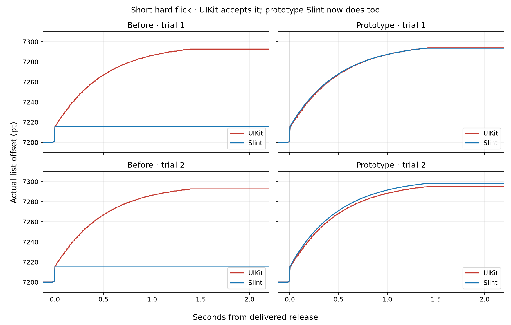

<!-- cspell:ignore UIKit HID Murmele -->
# Native Release-Gate Prototype

The prototype fixes a reproduced short-flick failure using measured native input and release decisions.
It is based on Murmele's scrolling engine at `34eca81ab1`.
The core suite passes all 405 tests.
Four matching Release phone captures pass, including two native-accepted short-flick regressions.

## Evidence and Change

Raw IOHID packet timestamps and positions, UIKit touch values, recognizer state, and release delegates were recorded together.
The capture also logs Slint's actual touch-dispatch animation ticks.
The UIKit pan estimate matches an 80/20 blend of the latest two primary movement segment velocities.
Its scroll-release estimate matches a 60/35/5 blend of the latest three.
All 11 moving gestures in the earlier manual recording match the pan formula within 0.056 pt/s.
That difference is within the precision lost when the original positions were saved to three decimal places.

In two accelerating captures, UIKit accepted pan speeds of 413.4 and 424.0 pt/s.
The corresponding scroll-release speeds were only 163.8 and 163.7 pt/s.
UIKit coasted 76.7 points in both; Slint did not coast.
Slint applied its 250 pt/s gate to the scroll estimate rather than the pan estimate.

The prototype retains both estimates.
It uses pan velocity for the iOS start decision and scroll velocity for the animation.
Missing segment weights are assigned to the oldest available segment rather than becoming zero movement.
This differs from renormalizing the remaining weights.
For the original two-move manual flick, it predicts a 401.6 pt/s pan estimate and a 357.1 pt/s scroll estimate.
The latter predicts the observed 173.3-point UIKit coast.
The prototype does not append finger-up movement to the estimator or feed coalesced sub-samples into it.

## Phone Results

| Short-Flick Capture | UIKit Travel | Slint Travel | Slint Minus UIKit |
| --- | ---: | ---: | ---: |
| Before, trial 1 | 76.667 pt | 0 pt | -76.667 pt |
| Before, trial 2 | 76.667 pt | 0 pt | -76.667 pt |
| Prototype, trial 1 | 78.000 pt | 77.634 pt | -0.366 pt |
| Prototype, trial 2 | 79.000 pt | 82.413 pt | +3.413 pt |

Each capture starts a fresh view.
Delivered input varies between repetitions; matching requested profiles does not establish identical delivered velocities.
Every comparison is between the two lists receiving the same delivered gesture in that capture.

The chart uses actual offsets and seconds from the shared delivered release.
Neither axis is normalized.

## Limits and Preserved Evidence

The backend still estimates timing from dispatch rather than forwarding the captured primary-touch timestamp.
The two other captures retain post-release travel differences of 16.0 and 13.9 points.
This prototype is not complete velocity or physics parity.
It also leaves the existing inactivity cutoff and pan-entry behavior unchanged.

The exact-hold experiment demonstrates retained UIKit velocity after approximately 300 ms without new movement samples.
Six one-pixel movement updates replace that history and produce no native deceleration.
These are different delivered histories; the held control must not be dismissed merely because its outcome contradicted an expectation.

The attached HID packets were readable, including historical touch packets.
The app's earlier `_handleHIDEvent:` hook was available but received no calls during the synthetic captures.
The recording therefore does not establish a complete pre-UIKit HID ingress stream.

The accelerating gate test discriminates the start rules.
The requested decelerating test did not deliver the intended opposite-side boundary and remains inconclusive for that distinction.
Raw CSV, HID JSONL, and `.xcresult` artifacts remain local under `output/ios-hid-diagnosis-2026-10-05`.
All earlier failed prototypes remain preserved on their separate local branch.
Nothing has been pushed.
