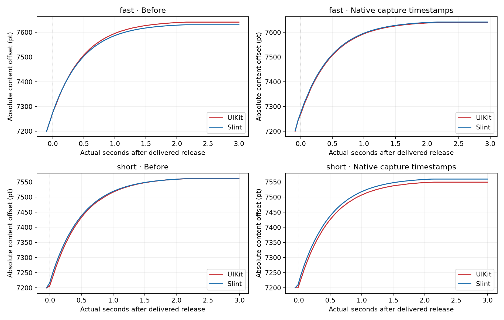
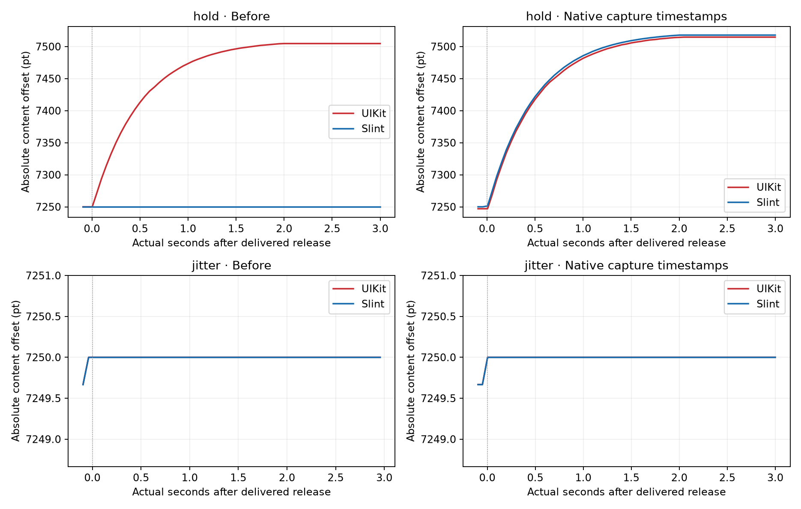
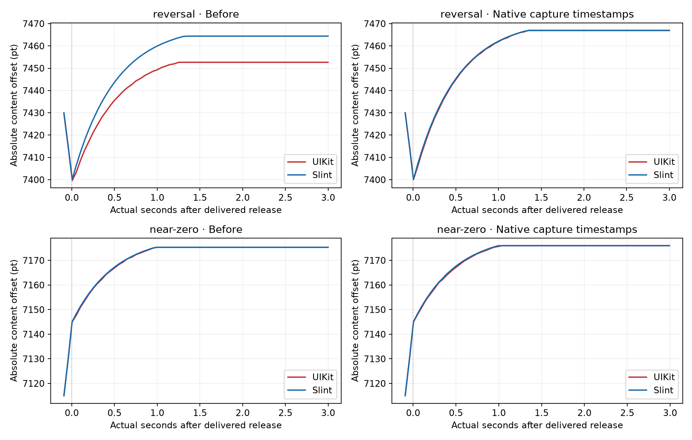

# Input Timing and Idle Release

We rebased PR #9 onto Murmele's `mm/flickable-scroll-animation-v2` at `9effee0372`.
That commit adds a manual comparison app without changing the engine.
Both comparison apps now share application-level touch forwarding instead of adding a gesture recognizer to UIKit.
The forwarding change doesn't eliminate all start-position differences.

## Changes in the PR

- The iOS Winit backend supplies a fresh per-event delivery timestamp instead of falling back to the animation tick.
- The native iOS tracker retains its estimate when no new movement samples arrive.
  Linux, embedded, macOS, and the general tracker retain their existing expiration policy.
- Stationary or jitter samples still update the tracker and close the release gate.
- The measured 80/20 pan blend, 60/35/5 scroll blend, and minimum launch-speed guard remain unchanged.
- Both manual apps use the same forwarding utility and their own recording callbacks.
  Native offsets and native velocity don't drive Slint.

## Capture Timestamps Need a Winit Change

Stock Winit 0.30.13 doesn't expose the UIKit capture timestamp in its touch event.
The mergeable change samples delivery time; it doesn't claim that delivery time equals capture time.

Apple documents [`UITouch.timestamp`](https://developer.apple.com/documentation/uikit/uitouch/timestamp) as the touch's system-uptime timestamp.
[`CACurrentMediaTime`](https://developer.apple.com/documentation/quartzcore/cacurrentmediatime()) provides the corresponding Mach-based uptime clock in seconds.
The companion Winit experiment maps the captured timestamp to a stable monotonic epoch before queuing the event.
The Slint integration maps it to the context's epoch without consulting animation ticks.

`winit-capture-time.patch` contains that Winit API proposal.
`slint-winit-capture-time.patch` contains its backend integration and clock-mapping regression.
Neither patch is applied in the ordinary PR build.
No local path dependency or experimental environment flag is required by the PR.
Winit dependency integration remains necessary for capture-time precision.

## Focused Phone Results

We ran six gestures before the changes and six with real capture timestamps and idle retention.
Each row compares UIKit and Slint within the same delivered gesture.
Before/after automation requests don't guarantee identical delivered velocities.

| Case | Before UIKit Travel (pt) | Before Slint Travel (pt) | Capture-Time UIKit Travel (pt) | Capture-Time Slint Travel (pt) | Capture-Time Error (pt) |
| --- | ---: | ---: | ---: | ---: | ---: |
| Fast decelerating flick | 363.333 | 352.576 | 363.333 | 363.548 | +0.215 |
| Short hard flick | 348.333 | 337.703 | 336.667 | 336.937 | +0.270 |
| Exact 300 ms hold | 254.667 | 0.000 | 267.667 | 267.833 | +0.166 |
| Stationary/jitter input | 0.000 | 0.000 | 0.000 | 0.000 | 0.000 |
| Direction reversal | 53.000 | 64.401 | 67.000 | 66.918 | -0.082 |
| Requested near-zero launch | 30.333 | 30.329 | 31.000 | 30.961 | -0.039 |

The final request didn't deliver a near-zero launch.
UIKit coasted in both captures, so this is a measured low-speed comparison, not proof of rejection below the stop speed.
The deterministic minimum-launch-speed regression covers rejection separately.

Two additional gestures checked the ordinary build with stock Winit:

| Case | UIKit Travel (pt) | Slint Travel (pt) | Error (pt) |
| --- | ---: | ---: | ---: |
| Fast flick | 362.333 | 362.848 | +0.514 |
| Short flick | 341.000 | 330.042 | -10.958 |

Fresh delivery time reduces animation-tick quantization but doesn't solve short-flick timing by itself.
The native capture-time experiment produces much closer travel and identifies the remaining dependency work.

## Actual Position Curves

The figures use actual elapsed seconds and absolute content offsets.
They don't rescale time, distance, or velocity.
The recording runs at 120 Hz; plotted samples retain their actual timestamps at approximately 20 Hz.
These are model-offset measurements, not a measurement of GPU presentation time.

## Validation and Remaining Issues

The 14 phone captures completed with one touch, no HID serialization errors, and frame gaps below 30 ms.
The analyzer asserts a 0.5-point post-release travel bound for the six native capture-time cases.
All six satisfy it; the ordinary fallback's short-flick error remains open.

Ten targeted velocity-tracker tests pass, including idle retention, stationary rejection, sparse samples, and non-iOS policy preservation.
The clock-mapping regression passed against the capture-time integration.
Murmele's new manual app also compiles for `aarch64-apple-ios` in Release with shared forwarding.
We didn't run its large matrix.

Start offsets remain separate from post-release travel.
The native capture-time short flick starts its coast with Slint 10 points ahead, despite matching subsequent travel within 0.270 points.
The held capture retains a 2.999-point start gap.
The first animation frames also remain imperfectly aligned.
This work doesn't establish complete pan-start, animation-timing, spring-back, or boundary-collision parity.

The interrupted broad audit and its failures remain preserved locally.
It isn't reported as a completed full-suite run.

## Reproduce the Evidence

Run `analyze.py EVIDENCE_DIRECTORY OUTPUT_DIRECTORY` with Python, Matplotlib, and NumPy installed.
The evidence directory contains `before/raw`, `after/raw`, and `delivery/raw`.
Raw device clocks, touch identities, and HID packets remain local.
The committed position CSVs contain only release-relative time and both offsets.

For the dependency experiment, copy Winit 0.30.13 to a separate checkout and apply `winit-capture-time.patch` there.
Apply `slint-winit-capture-time.patch` to a separate Slint worktree and override Winit locally for that build.
Keep the override out of published Cargo manifests and lockfiles.
